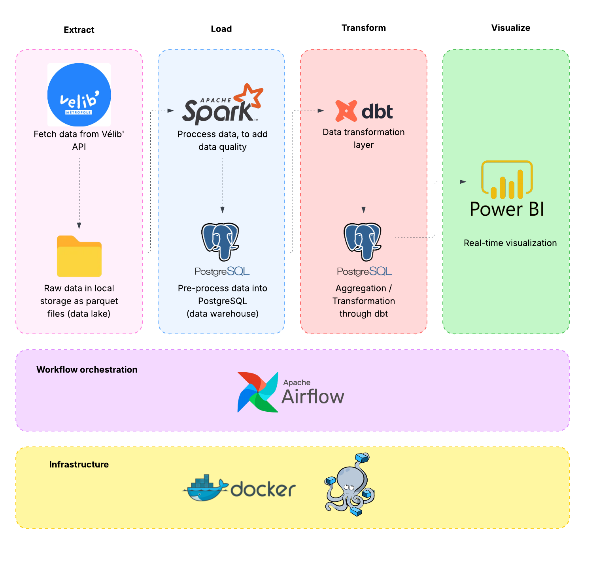

# 🚴 Vélib' Data Pipeline - Paris Bicycle Sharing Analytics

This project was created to be submited to the online free couse  [Data Engineering Zoomcamp 2026][zoomcamp_website_link] run by **DataTalks Club**.

## 📊 Problem definition

This project aims to **build a data platform** based on **Vélib' open source database** in order to transform raws data stream into exploitable business indicators.

The goal is to provide spatio-temporal analysis of the bicycle availability, to identify areas under pressure and to provide a database for availability prediction models.

The project covers the entire data value chain: **data acquisiton, pre-processing, storage, analysis, visualization**.


## 🎯 Main Objective

- [ ] Ingest real-time Vélib data every 15 minutes
- [ ] Store raw data in a data lake like solution
- [ ] Process raw data en store valuable data in a data warehouse
- [ ] Transform valuable data to hilight business case
- [ ] Use data vizualisation to show what have been done

## 🏗️ Architecture



## 🛠️ Tech Stack

| Component | Technology | Role in the project |
|-----------|-------------|---------------------|
| Orchestration  | **Apache Airflow**                   | Airflow orchestrates the entire pipeline: scheduling batch ingestion jobs, managing dependencies between tasks (ingestion → storage → processing → transformation → analytics), and monitoring pipeline health. It enables reproducibility and production-grade workflow management, even in a local environment. |
| Ingestion      | **Python (requests + pandas)**       | Python is used for batch data ingestion from the Vélib' open data API every 15 minutes. It provides flexibility, simplicity, and strong ecosystem support for API ingestion, data validation, and preprocessing before storage.                                                                                   |
| Data Lake      | **Local filesystem (Parquet files)** | A local data lake is implemented using partitioned **Parquet files** on the filesystem. This simulates cloud data lake architectures (S3/GCS/ADLS) while remaining fully local. Parquet ensures efficient storage, compression, schema evolution, and analytical performance.                                     |
| Processing     | **Apache Spark**                     | Spark is used for batch processing and enrichment of raw data. It enables scalable transformations, partitioning strategies, and future-proofing for large-scale data volumes. Spark also introduces distributed processing concepts used in real production data platforms.                                      |
| Data Warehouse | **PostgreSQL**                       | PostgreSQL acts as the analytical data warehouse. It stores cleaned, structured, and business-ready datasets. PostgreSQL is reliable, SQL-native, production-proven, and integrates naturally with dbt and BI tools.                                                                                              |
| Transformation | **dbt**                              | dbt structures the transformation layer using SQL models, tests, and documentation. It enforces analytics engineering best practices: versioned transformations, lineage, modularity, testing, and reproducibility.                                                                                               |
| Infrastructure | **Docker + Docker Compose**          | Docker provides fully reproducible local infrastructure. All services (Airflow, Spark, PostgreSQL) run in isolated containers, simulating production deployment patterns and ensuring environment consistency.                                                                                                    |
| Visualization  | **Power BI**                         | Power BI is used for dashboarding and business visualization. It provides rich interactive analytics, strong PostgreSQL integration, and enterprise-grade BI features for spatio-temporal analysis and operational insights.                                                                                      |


## 📁 Data Model

### Bronze Layer
Raw Vélib API data (Parquet, Data Lake)
- `velib_raw_snapshots` :

### Silver Layer
Cleaned & enriched datasets (Spark)
- `stations` : [DESCRIPTION]
- `station_snapshots` : [DESCRIPTION]

### Gold Layer
Business models (dbt + PostgreSQL)
- [VOS TABLES ANALYTICS]

## 🚀 Getting Started

### Prérequis
- Docker & Docker Compose
- [AUTRES PRÉREQUIS]

### Installation
```bash
# 1. Cloner le repo
git clone [URL]

# 2. [VOS ÉTAPES]
```

## 📈 Métriques & KPIs

- [LISTE DE VOS KPIs MÉTIER]

## 🔍 Analyses possibles

- [EXEMPLES D'ANALYSES QUE VOTRE PIPELINE PERMET]

## 📚 Learnings & Challenges

[À REMPLIR AU FUR ET MESURE]

### Défis rencontrés
- [CHALLENGE 1]
- [CHALLENGE 2]

### Solutions apportées
- [SOLUTION 1]

## 🔮 Futures Evolution

- [ ] Migration vers GCP/AWS
- [ ] Ajout streaming temps réel avec Kafka
- [ ] [VOS IDÉES]

### Local-first, cloud-ready:

- Local filesystem = S3/GCS equivalent

- PostgreSQL = BigQuery/Snowflake equivalent

- Spark = scalable processing layer

- Airflow = production-grade orchestration


[zoomcamp_website_link]: https://github.com/DataTalksClub/data-engineering-zoomcamp