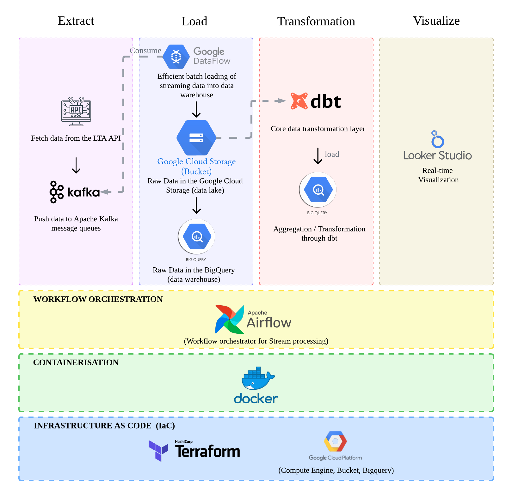

# 🚴 Vélib Data Pipeline - Paris Bike Sharing Analytics

## 📊 Problématique

[VOTRE PROBLÉMATIQUE ICI - 2-3 paragraphes]
- Contexte métier
- Objectif du pipeline
- Valeur business attendue

## 🎯 Objectifs du projet

- [ ] Ingérer les données Vélib temps réel toutes les X minutes
- [ ] Historiser les snapshots pour analyse temporelle
- [ ] Transformer les données en métriques business
- [ ] [AJOUTEZ VOS OBJECTIFS]

## 🏗️ Architecture



### Vue d'ensemble
[DESCRIPTION DE VOTRE ARCHITECTURE]

### Flux de données
1. **Bronze (Raw)** : [DÉCRIRE]
2. **Silver (Cleaned)** : [DÉCRIRE]
3. **Gold (Analytics)** : [DÉCRIRE]

## 🛠️ Stack Technique

| Composant | Technologie | Rôle dans le projet |
|-----------|-------------|---------------------|
| Orchestration | Airflow | [VOTRE JUSTIFICATION] |
| Processing | Spark | [POURQUOI SPARK ?] |
| Transformation | dbt | [CAS D'USAGE] |
| Storage | PostgreSQL | [POURQUOI POSTGRES ?] |
| Infrastructure | Docker | [BÉNÉFICES] |

## 📁 Data Model

### Bronze Layer
- `velib_raw_snapshots` : [DESCRIPTION]

### Silver Layer
- `stations` : [DESCRIPTION]
- `station_snapshots` : [DESCRIPTION]

### Gold Layer
- [VOS TABLES ANALYTICS]

## 🚀 Getting Started

### Prérequis
- Docker & Docker Compose
- [AUTRES PRÉREQUIS]

### Installation
```bash
# 1. Cloner le repo
git clone [URL]

# 2. [VOS ÉTAPES]
```

## 📈 Métriques & KPIs

- [LISTE DE VOS KPIs MÉTIER]

## 🔍 Analyses possibles

- [EXEMPLES D'ANALYSES QUE VOTRE PIPELINE PERMET]

## 📚 Learnings & Challenges

[À REMPLIR AU FUR ET MESURE]

### Défis rencontrés
- [CHALLENGE 1]
- [CHALLENGE 2]

### Solutions apportées
- [SOLUTION 1]

## 🔮 Évolutions futures

- [ ] Migration vers GCP/AWS
- [ ] Ajout streaming temps réel avec Kafka
- [ ] [VOS IDÉES]

## 📝 License