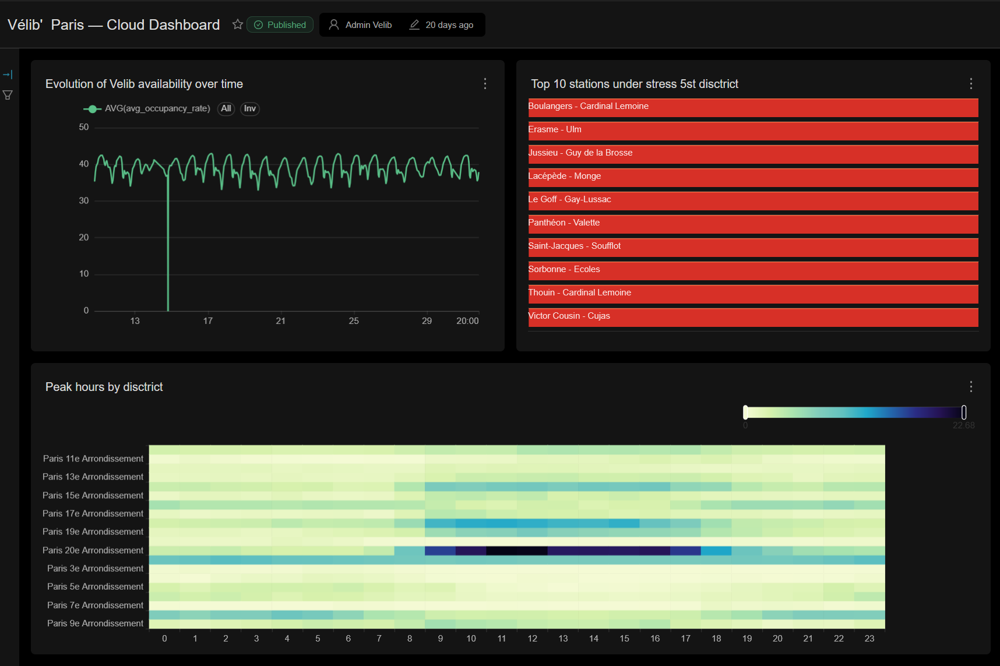
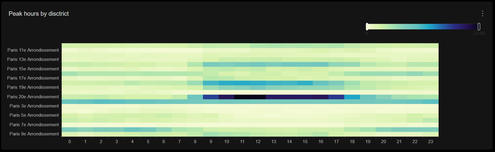
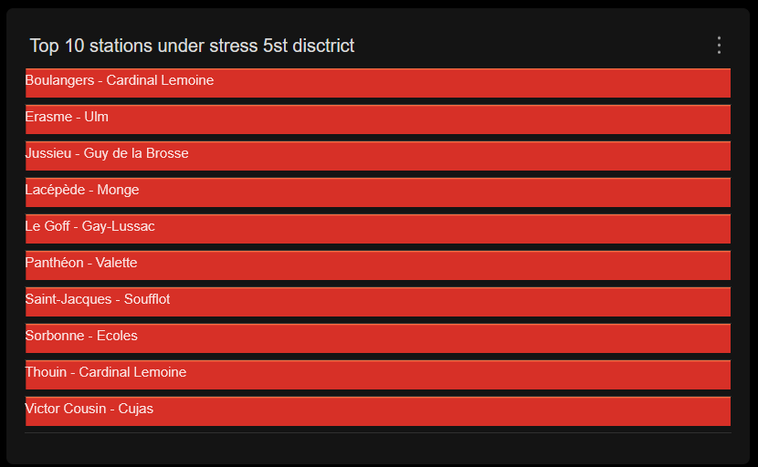
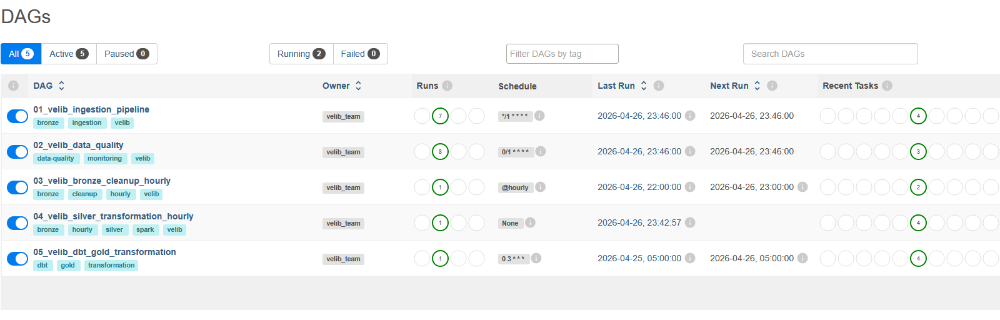
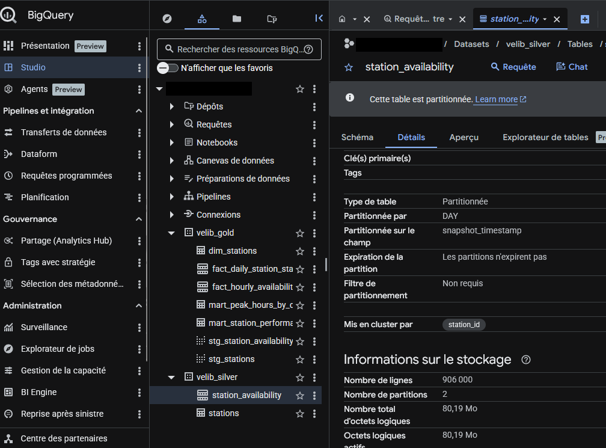
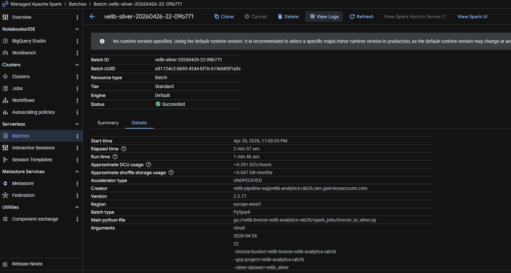
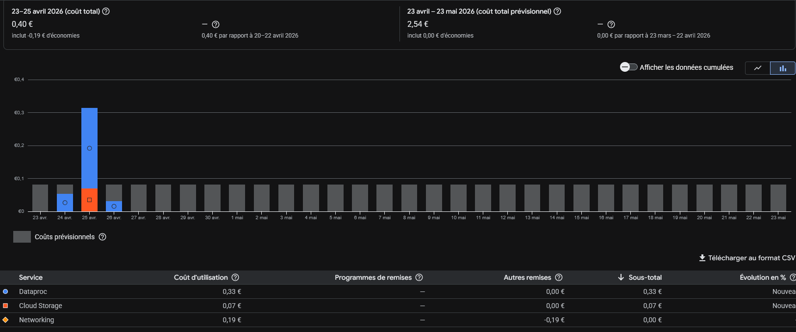
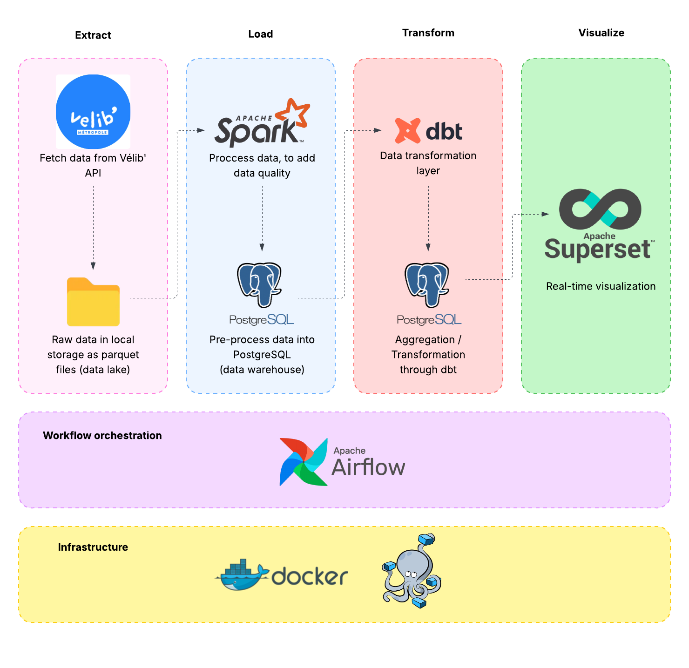
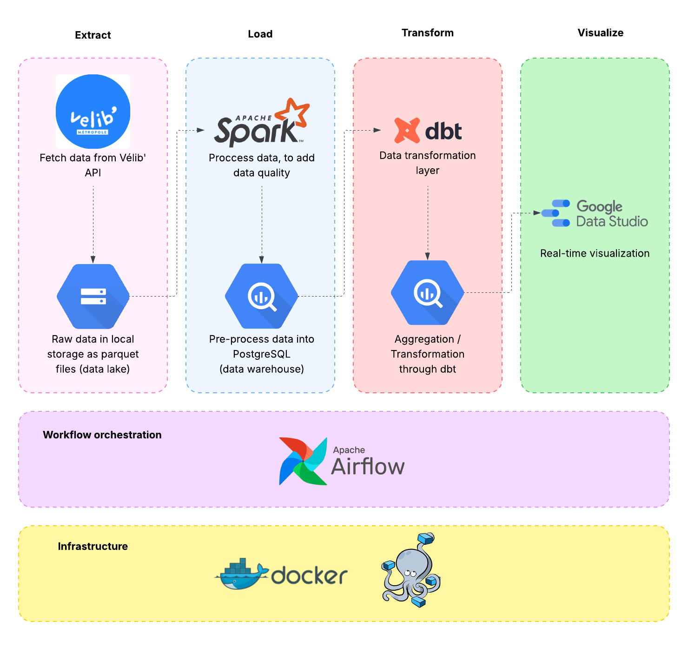

# 🚴 Vélib' Data Platform

**End-to-end data engineering pipeline for Paris' bike sharing network — from real-time API ingestion to analytics-ready dashboards.**

[](https://airflow.apache.org/)
[](https://spark.apache.org/)
[](https://www.getdbt.com/)
[](https://www.postgresql.org/)
[](https://superset.apache.org/)
[](https://www.docker.com/)

---

## Overview

A production-grade, local-first data platform that ingests real-time Vélib' open data every minute, lands it in a partitioned data lake, transforms it through Bronze → Silver → Gold layers with Spark and dbt, runs automated quality checks, and serves analytical models for operational dashboarding in Superset.

The project was built as the capstone of the [Data Engineering Zoomcamp 2026](https://github.com/DataTalksClub/data-engineering-zoomcamp) by DataTalks Club.

> **Capability snapshot:** 1,500+ Vélib' stations tracked · ~1.1k snapshots ingested per day · 7 dbt models (5 Gold marts) · 2.5 GB partitioned data lake · hourly Bronze → Silver → Gold refresh

---

## Screenshots

### Local pipeline

| | |
|---|---|
| **Superset operational dashboard** |  |
| **Peak hours by district** |  |
| **Top stations under stress** |  |
| **Airflow DAGs running on schedule** |  |

### Cloud deployment (GCP)

| | |
|---|---|
| **BigQuery Silver and Gold datasets** |  |
| **Dataproc Serverless Bronze-to-Silver batch** |  |
| **Monthly cost under budget** |  |

---

## Architecture





The pipeline follows the medallion architecture pattern with clear separation of concerns:

**Bronze layer** captures raw API snapshots as partitioned Parquet files on local disk, with stable schema and geo flattening applied at ingestion time. Partitioning by `ingestion_date` and `hour` keeps downstream reads fast and enables incremental processing.

**Silver layer** is materialized in PostgreSQL after a Spark job reads the previous hour's Bronze partition, applies data cleaning and normalization, computes operational metrics (occupancy rate, availability rate, service rate), and enriches Paris stations with their administrative district using official GeoJSON boundaries.

**Gold layer** is built with dbt on top of Silver. It exposes dimensional models, hourly and daily facts, and business-oriented marts designed to power Superset dashboards focused on real-time operational monitoring.

---

## Tech stack

| Layer | Tool | Role |
|---|---|---|
| Orchestration | Apache Airflow | Scheduling, dependency management, trigger-based DAG chaining |
| Ingestion | Python, Requests, Pandas | Real-time API extraction, schema stabilization, Bronze writes |
| Processing | Apache Spark | Distributed Bronze to Silver transformations and enrichment |
| Warehouse | PostgreSQL | Silver analytical storage |
| Transformation | dbt | Gold models, testing, lineage documentation |
| Data lake | Local filesystem, Parquet | Raw snapshot storage with date and hour partitioning |
| Infrastructure | Docker, Docker Compose | Reproducible local deployment |
| Visualization | Apache Superset | BI dashboards on Gold models |
| Code quality | ruff, black, sqlfluff | Consistent style across Python and SQL |

---

## Pipeline components

The platform runs five Airflow DAGs, each with a single, well-defined responsibility.

| DAG | Frequency | Purpose |
|---|---|---|
| `01_velib_ingestion_pipeline` | every minute | API extraction, schema enforcement, Bronze write, basic validation |
| `02_velib_data_quality` | every minute | Schema, null, duplicate, freshness, range and consistency checks with persisted reports |
| `03_velib_bronze_cleanup_hourly` | hourly | Removes corrupted Parquet files and minute-level duplicates from the previous hour partition |
| `04_velib_silver_transformation_hourly` | trigger-based | Executes the Spark job, loads Silver tables, validates the output |
| `05_velib_dbt_gold_transformation` | daily at 03:00 | Runs dbt deps, staging, gold and tests |

The Spark job itself (`spark_jobs/bronze_to_silver.py`) handles field cleaning, normalization, the three operational metrics and the loading of both the station dimension and the availability facts into PostgreSQL.

---

## Data model

### Bronze — Parquet partitions

Partitioned by `ingestion_date` and `hour`, with stable schema across snapshots. Key fields include station identity (`stationcode`, `name`, `capacity`), real-time availability (`numdocksavailable`, `numbikesavailable`, `mechanical`, `ebike`), operational status (`is_installed`, `is_renting`, `is_returning`), geography (`lat`, `lon`, `nom_arrondissement_communes`) and lineage markers (`ingestion_timestamp`, `snapshot_id`).

### Silver — PostgreSQL

- `silver.stations` — station dimension with Paris district enrichment
- `silver.station_availability` — time-based availability facts

### Gold — dbt models

- `gold.dim_stations`
- `gold.fact_hourly_availability`
- `gold.fact_daily_station_stats`
- `gold.mart_station_performance`
- `gold.mart_peak_hours_by_district`

---

## Notable engineering decisions

**Historical snapshots from a real-time API.** The Vélib' API only exposes the current state of the network. Building historical analytics required designing a reliable minute-level ingestion loop, a stable Bronze schema that survives upstream API changes, and a lineage marker (`snapshot_id`, `ingestion_timestamp`) on every row to support deduplication and replay.

**Schema stability across rapid Parquet writes.** Writing Parquet every minute under schema drift is a known failure mode. The ingestion DAG enforces a typed column contract and flattens the nested `coordonnees_geo` field at write time, so downstream Spark and dbt reads never hit mixed schemas.

**Trigger-based DAG orchestration instead of time-based coupling.** The Silver transformation is not scheduled directly — it is triggered only after the Bronze cleanup confirms the previous hour's partition is clean. This eliminates a whole class of race conditions between writers and readers.

**Running Spark from Airflow inside Docker.** The Airflow scheduler uses the Docker SDK to spawn the Spark job container, avoiding the brittleness of `docker exec` from inside a DAG. Silver validation and summary tasks hit PostgreSQL directly through standard connections.

**District-level enrichment for operational analytics.** Paris stations are mapped to their official arrondissement by joining their coordinates against the municipal GeoJSON boundary file. This turns geographic coordinates into a business-meaningful dimension that powers the `mart_peak_hours_by_district` analytics.

**Data quality as a first-class citizen.** Quality is not a post-hoc check but a dedicated DAG running at ingestion frequency, with partitioned text reports stored in `data_lake/reports/data_quality/`. Every report records rows checked, tests passed and failed, and a per-check PASS or FAIL message.

---

## Getting started

### Prerequisites

- Docker Desktop or Docker Engine
- A Linux or WSL terminal
- `make`
- `python3` (recommended for the local linting and formatting tooling)

### Bootstrap

```bash
git clone https://github.com/rabeur/VelibAvailability_DE_Project.git
cd VelibAvailability_DE_Project

make first-launch      # build, up, init database, init Superset
make status            # check service health
```

### Service endpoints

| Service | URL | Default credentials |
|---|---|---|
| Airflow | http://localhost:8081 | `admin` / `admin` |
| Spark Master UI | http://localhost:8080 | — |
| Superset | http://localhost:8088 | `admin` / `admin` (`SUPERSET_ADMIN_PASSWORD` in `.env`) |
| pgAdmin | http://localhost:5050 | `admin@velib.com` / `admin` |
| PostgreSQL | localhost:5432 | `velib` / `velib` (db `velib_dw`) |

Credentials are generated on first run by `make first-launch` into `.env`
(gitignored). Change them there before exposing any service beyond
localhost.

### DAG cadence

| DAG | Schedule | Produces |
|---|---|---|
| `01_velib_ingestion_pipeline` | every minute | Parquet snapshot in `data_lake/bronze/velib/` |
| `02_velib_data_quality` | every minute | CSV report in `data_lake/reports/data_quality/` |
| `03_velib_bronze_cleanup_hourly` | hourly at H+0, scans H−1 | Removes corrupted/duplicate parquets, triggers silver |
| `04_velib_silver_transformation_hourly` | triggered by the cleanup | Populates `silver.stations` and `silver.station_availability` |
| `05_velib_dbt_gold_transformation` | daily at 03:00 UTC | Builds 5 `gold.*` tables via dbt |

Silver is downstream of a *completed* Bronze hour, so the first Silver
rows appear about one hour after the first ingestion. To validate the
full chain without waiting for the 03:00 UTC schedule, run `make dbt-all`
once Silver is populated.

### Smoke test

After `make first-launch`, give the stack ~5 min then:

```bash
make status                                          # all containers running / healthy
find data_lake/bronze/velib -name '*.parquet' | wc -l   # > 0
docker exec velib_postgres psql -U velib -d velib_dw \
  -c "SELECT COUNT(*) FROM silver.stations;"        # > 0 once an hour has passed
make dbt-all                                         # 5 gold tables, 30/30 tests PASS
```

### Troubleshooting first launch

- **`PermissionError: /opt/airflow/logs/scheduler` in the scheduler logs.**
  Docker created `airflow/logs` or `airflow/plugins` as root before
  `make first-launch` chowned them. Fix with `make fix-perms` (requires
  `sudo`) or `make give-perms` for dev mode, then restart the Airflow
  services: `make restart SERVICE=airflow-scheduler && make restart
  SERVICE=airflow-webserver`.
- **Silver tasks fail with `conn_id 'google_cloud_default' isn't defined`.**
  Your `.env.cloud` still has `PIPELINE_TARGET=cloud` enabled and a prior
  version of the Makefile auto-sourced it. Ensure `PIPELINE_TARGET=local`
  (or comment it out) in `.env.cloud`, then `make down && make up`.
  With the current Makefile, `.env.cloud` is only sourced by `cloud-*`
  targets, so `make up` always runs local mode.
- **`port is already allocated` when running `make up`.** Another process
  is bound to 5432, 5050, 8080, 8081 or 8088. Free the port or stop the
  competing stack, then `make up`.
- **Superset login fails with `superset_meta` errors.** Run `make
  superset-db` once (idempotent) and `make restart SERVICE=superset`.
- **Cloud mode: `PermissionError: /etc/gcp/service_account.json`.** The
  service account JSON on the host is world-unreadable (`0600`, owned by
  your UID). The Airflow containers run as UID 50000 and cannot open it.
  Run `chmod 644 <keyfile>` on the host and retry the task — no container
  restart needed.

### Code quality

```bash
make format-python
make lint-python
make format-sql
make lint-sql
```

### Cloud deployment (GCP, optional)

A parallel deployment on Google Cloud is available behind a `PIPELINE_TARGET=cloud` switch. The local pipeline keeps working unchanged; the cloud branch swaps the filesystem for GCS, local Spark for Dataproc Serverless, and PostgreSQL for BigQuery. Airflow and dbt run in the same local containers in both modes.

Full guide in `cloud/README.md`, cost rules in `cloud/docs/cost_management.md`, target diagram in `cloud/docs/architecture.md`.

Quickstart once `.env.cloud` and `cloud/terraform/terraform.tfvars` are filled in:

```bash
make build                 # rebuild dbt image with dbt-bigquery adapter
make cloud-init            # terraform init (one-off)
make cloud-plan            # review the diff
make cloud-up              # typed confirmation required
make cloud-stack-up        # docker compose up with .env.cloud sourced (instead of make up)
make cloud-deploy-spark    # upload Spark job to the Bronze bucket
make cloud-dbt-run         # materialise Gold on BigQuery
make cloud-down            # at the end of a dev session
```

`.env.cloud` is only sourced by `cloud-*` targets, so `make up` always
runs the local pipeline regardless of what sits in `.env.cloud`.

---

## Example analyses enabled

- Bike availability trends by hour and day
- Station occupancy stress zones
- Empty and full station rates by time bucket
- Data freshness and ingestion reliability monitoring
- Paris operational analysis by arrondissement

### Superset dashboard example

| Chart | Dataset | Metric | Business value |
|---|---|---|---|
| Network pressure over the last few hours | `gold.fact_hourly_availability` | `AVG(avg_occupancy_rate)` | Real-time pressure on the network |
| Top 10 stations most often empty | `gold.mart_station_performance` | `AVG(avg_pct_time_empty)` | Highlights the most critical stations for riders |
| Peak pressure hours by arrondissement | `gold.mart_peak_hours_by_district` | `AVG(avg_occupancy_rate)` | Identifies when and where districts are under stress |

---

## Roadmap

The local platform is complete and operational.

### Delivered

**Cloud deployment on Google Cloud Platform.** The parallel GCP branch is wired end-to-end behind a `PIPELINE_TARGET=cloud` switch: Terraform-managed infrastructure (GCS, BigQuery, Dataproc Serverless, IAM), dual-mode Airflow DAGs, a dual-adapter dbt container, and `make cloud-*` targets. The local pipeline runs unchanged. See the [Cloud deployment](#cloud-deployment-gcp-optional) quickstart above and `cloud/README.md` for the full guide.

| Component | Local | GCP target |
|---|---|---|
| Data lake | Filesystem, Parquet | Google Cloud Storage |
| Processing | Spark on Docker | Dataproc Serverless |
| Warehouse | PostgreSQL | BigQuery |
| Transform | dbt-postgres | dbt-bigquery |
| Viz | Superset | Looker Studio |
| IaC | Docker Compose | Terraform |

### Planned

- Looker Studio dashboard mirroring the Superset KPIs (waiting on Silver/Gold history accumulation to make trend visualisations meaningful)
- CI pipeline for `ruff`, `sqlfluff` and dbt tests
- Alerting channels (email and Slack) for pipeline incidents
- KPI dictionary and business glossary
- Export of Superset datasets and charts as code

---

## Repository structure

```
VelibAvailability_DE_Project/
├── airflow/dags/              # Airflow DAGs (ingestion, quality, cleanup, Silver, Gold)
├── spark_jobs/                # Spark transformation jobs
├── dbt/                       # dbt project (staging, gold, tests)
├── data_lake/                 # Bronze Parquet partitions and quality reports
├── scripts/                   # Utility scripts (arrondissement enrichment, bootstrap)
├── docker-compose.yml
├── Makefile
└── README.md
```

---

## About

Built by **Adrien Rabier**, Data Engineer based in Paris.
4 years in software engineering on mission-critical industrial systems (RATP, SNCF, energy), specialized in SQL, data modeling, batch migrations and Python automation.

[LinkedIn](https://www.linkedin.com/in/adrien-rabier-9a699a150/) · [GitHub](https://github.com/rabeur) · rabiera69@gmail.com