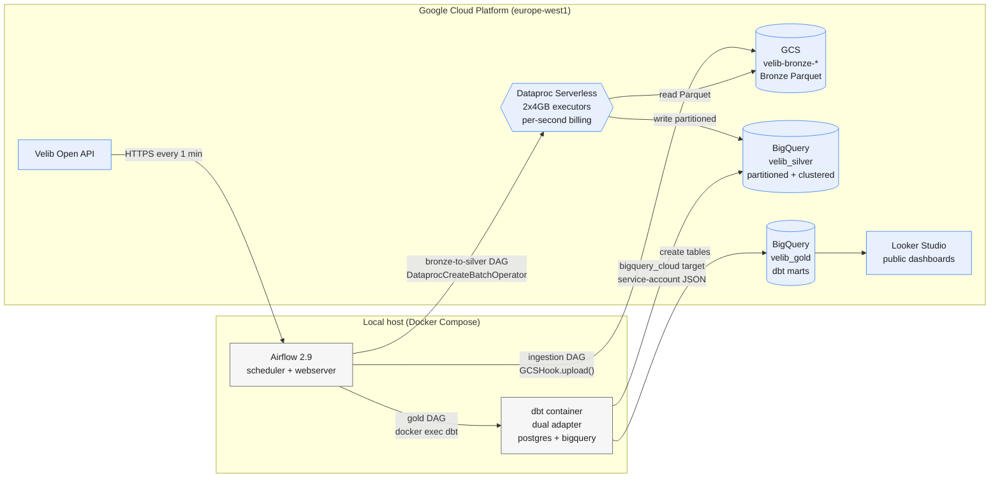

# Cloud architecture diagram

Target deployment of the Velib pipeline on Google Cloud Platform. Airflow
stays local; all storage, processing and warehousing happens on GCP. The
same `spark_jobs/` and `dbt/` sources power both the local and cloud
targets, selected at runtime by `PIPELINE_TARGET`.

## Data contract between layers

| Layer | Location (cloud mode) | Format | Partition | Clustering |
|-------|-----------------------|--------|-----------|------------|
| Bronze | `gs://velib-bronze-<proj>/bronze/velib/` | Parquet (snappy) | `ingestion_date=`, `hour=` | n/a |
| Silver | `<proj>.velib_silver.station_availability` | BigQuery native | day on `ingestion_timestamp` | `stationcode` |
| Silver | `<proj>.velib_silver.stations` | BigQuery native | none (dim) | `stationcode` |
| Gold | `<proj>.velib_gold.*` | BigQuery native, dbt-managed | model-specific | model-specific |

## Control plane

Airflow triggers every job; no Composer and no persistent Dataproc
cluster. Dataproc Serverless boots a batch on demand (60 to 90 s startup)
and shuts down immediately after, keeping the monthly bill within the
20 EUR budget target (see `cost_management.md`).

## IAM

A single `velib-pipeline-sa` service account acts for Airflow, Dataproc
jobs and dbt. Key JSON is mounted into the local containers via
`docker-compose.yml`, never committed. Terraform owns the role bindings
(`storage.objectAdmin` on the Bronze bucket, `bigquery.dataEditor` on
both datasets, `dataproc.editor` + `dataproc.worker` for batch
submission and execution).

## Relationship with the local diagram

`docs/diagrams/local_architecture_diagram.png` at the repository root shows the
same flow with Postgres + Superset in place of BigQuery + Looker Studio.
The two diagrams are intentionally isomorphic so the dual-mode DAGs and
Spark jobs can be audited in parallel.
